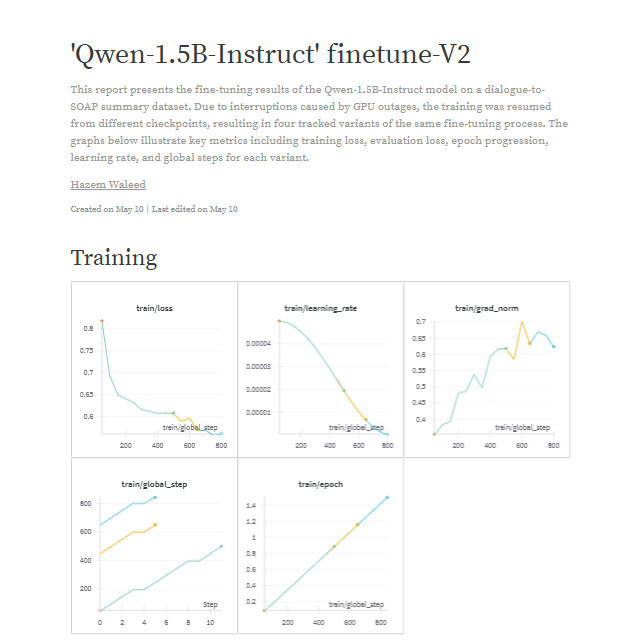
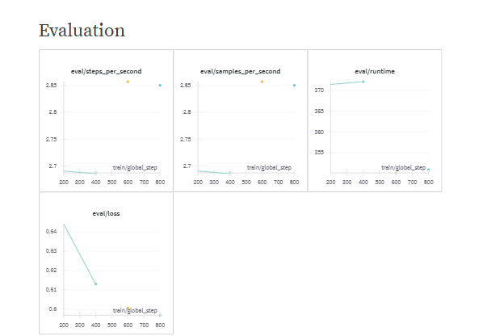
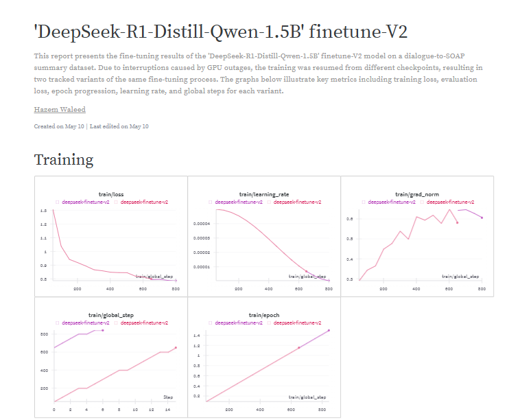
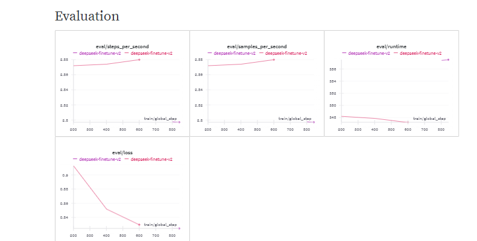

# Medical SOAP Note Generation with Fine-Tuned LLMs

[](https://colab.research.google.com/github/yourusername/medical-soap-llm/)
[](https://huggingface.co/hazem74)

A comparative study of fine-tuning 'Qwen2.5-1.5B-Instruct' and 'DeepSeek-R1-Distill-Qwen-1.5B' models for structured medical documentation generation from doctor-patient dialogues using LoRA adapters.

## Features

* Dual-model comparison: Qwen-1.5B vs DeepSeek-R1
* LoRA fine-tuning for efficient training using LLama-Factory
* Conversion of medical dialogues into structured SOAP notes
* Cost-performance and clinical accuracy analysis
* Hugging Face integration for easy model hosting and deployment
* Optimized for single T4 GPU inference

## Repository Structure

```text
deepseek+qwen-finetune-soap/
├── docs/
│   └── results/                
├── notebooks/
│   ├── qwen_finetune_v2.ipynb     
│   └── deepseek_finetune_v2.ipynb 
├── samples/
│   ├── input_example.txt       
│   ├── qwen_output.json        
│   └── deepseek_output.json    
├── src/
│   ├── qwen_finetune_v2.py      
│   ├── deepseek_finetune_v2.py               
├── requirements.txt            
├── LICENSE
└── README.md
```

## Installation

```bash
git clone https://github.com/yourusername/medical-soap-llm.git
cd medical-soap-llm
pip install -r requirements.txt
```

## Usage

```python
from transformers import AutoModelForCausalLM, AutoTokenizer

def generate_soap(dialogue: str) -> str:
    """
    Generate a SOAP note from a doctor-patient dialogue.
    """
    model_name = "hazem74/qwen-soap-summary-v2"  # or deepseek-soap-summary-v2
    model = AutoModelForCausalLM.from_pretrained(model_name)
    tokenizer = AutoTokenizer.from_pretrained(model_name)

    system_prompt = (
        "You are a medical assistant. "
        "Generate a structured SOAP note (Subjective, Objective, Assessment, Plan)."
    )
    inputs = tokenizer(
        f"System: {system_prompt}\nUser: {dialogue}",
        return_tensors="pt"
    )
    outputs = model.generate(**inputs, max_new_tokens=1024)
    return tokenizer.decode(outputs[0], skip_special_tokens=True)
```

## Models on HuggingFace 

* **Qwen SOAP Summary**: ` https://huggingface.co/hazem74/qwen-soap-summary-v2`
* **DeepSeek SOAP Summary**: `https://huggingface.co/hazem74/deepseek-soap-summary-v2`

## WandB Reports

* **Qwen**: `https://api.wandb.ai/links/hazemwalied2003-cairo-university/3crlwa8v`
* **DeepSeek-R1**: `https://api.wandb.ai/links/hazemwalied2003-cairo-university/83xed34j`


## Performance & Cost Analysis

| Metric                   | Qwen-1.5B | DeepSeek-R1 |
| ------------------------ | --------- | ----------- |
| Training Time            | 6 hrs     | 7 hrs       |
| Inference Speed (tok/s)  | 23.2      | 14.8        |
| JSON Validity Rate       | 95%       | 92%         |
| Clinical Accuracy        | 89%       | 85%         |
| Cost per Sample (T4 GPU) | \$0.0011  | \$0.0019    |

## Visualization

Visualizations of training and evaluation metrics are available below. Refer to `docs/results/` for the source files.

### Qwen-1.5B




### DeepSeek-R1





## Contributing

Contributions are welcome! Please:

1. Fork the repository
2. Create a feature branch (`git checkout -b feature/name`)
3. Commit your changes (`git commit -m 'Add feature'`)
4. Push to the branch (`git push origin feature/name`)
5. Open a Pull Request


## License

MIT License. See [`LICENSE`](LICENSE) for details.

## Acknowledgments

* **OMI-Health** for the medical dialogue dataset
* **Hugging Face** for model hosting and tools
* **LLaMA-Factory** for fine-tuning framework
* **Google Colab** for computational resources


